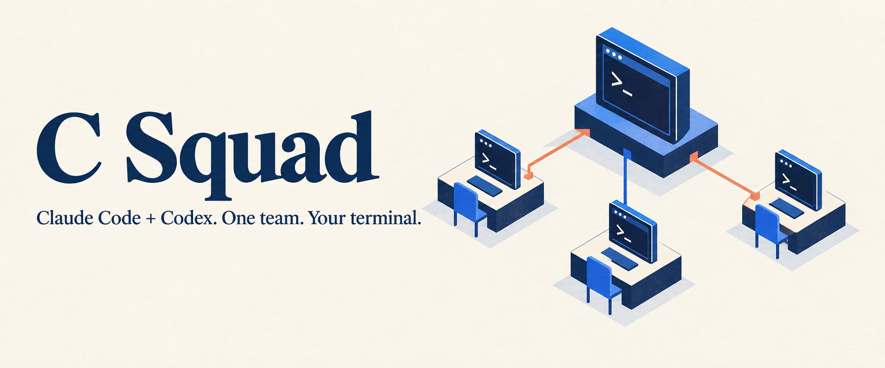

<p align="center">
  
</p>

<p align="center">
  <a href="LICENSE"></a>
  
  
</p>

# Run Claude Code and Codex as one team

**C Squad is a CLI that lets you give work to one lead agent, then have it recruit
and coordinate other Claude Code and Codex agents in your terminal.** The lead
is called **Master**. You talk to it; it delegates work and reports back.

For example, tell Master:

> Add a --done filter to this task-list CLI. Use Codex to implement and test it,
> and Claude to review the change. Ask me before merging.

Master creates the task, starts the members, and passes work between them. Each
agent has its own tmux session. You can switch between them to see what they are
doing, or stay with Master and ask for an update.


*Click a member to follow its work. Task cards show progress and review evidence.*

## Why use it?

When you already use coding agents, coordinating several of them becomes work:
opening terminals, repeating context, passing review feedback around, and
keeping track of who is waiting for whom. C Squad gives that coordination to
Master.

- **Delegate a whole workflow.** Ask for implementation, tests, and review in one
  conversation. Members report results and blockers back to Master.
- **Mix the tools you use.** Choose Claude Code or Codex for each member, with
  your existing accounts and native CLI configuration.
- **Keep code work separate.** Each development task gets a Git worktree, so
  parallel tasks can be reviewed before they reach your main branch.
- **See the work as it happens.** Open any member's native terminal session;
  ask Master for progress without manually collecting every agent's response.

It is most useful for work that benefits from separate implementation and review,
or several independent tasks. For a small one-line fix, one agent is usually enough.
Each running agent uses its own engine account's quota.

## Quick start

### 1. Install

**npm — macOS / Linux / WSL 2**

```sh
npm install -g csquad
csquad completion install --shell zsh   # macOS: run/save the printed loading line
```

Install [system dependencies](docs/install.md#npm) separately, or use Homebrew/APT
below to install them together with C Squad. You can also run `npx csquad`.

**macOS / Homebrew**

```sh
brew tap ShunL12324/c-squad https://github.com/ShunL12324/c-squad
brew install ShunL12324/c-squad/csquad
```

**Ubuntu / Debian / WSL 2** — [add the APT repository once](docs/install.md#ubuntu--debian), then:

```sh
sudo apt update
sudo apt install csquad
```

Homebrew and APT install a precompiled C Squad binary and tmux. You also need an installed,
signed-in **Claude Code or Codex CLI**; set up both to use a mixed-engine team.
Code tasks need Git, which Homebrew installs and APT normally installs as a
recommended dependency.

Prefer a manual install? Download a package for your platform from
[Releases](https://github.com/ShunL12324/c-squad/releases/latest).
See [Installation](docs/install.md) for details. Native Windows is not supported;
use WSL 2 instead.

### 2. Start in your project

```sh
cd /path/to/your/project
csquad doctor
csquad new -s my-team --engine claude
```

Create a named team with `csquad new -s NAME`; `csquad start --name NAME`
remains compatible. Use `list` to find teams, `attach NAME` to enter a running
team, `resume NAME` to restore a stopped team, and `stop NAME` to stop it.

Use `--engine codex` if you want Codex as Master. C Squad opens tmux for you;
there is no separate server or tmux session to start by hand. For development
tasks, your project must be a Git repository with at least one commit.
`start` always creates a new team and rejects an existing name. Continue a saved
team with `csquad resume my-team`, or connect to a running one with `csquad attach my-team`.

### 3. Give Master a task

Type your request into the agent conversation that opens:

> Fix the login bug described in issue 42. Have a developer implement the fix
> and another member review it. Run the tests and ask me before merging.

Master recruits the members and assigns the work. You do not need to create
roles, send messages, or manage worktrees yourself. When you want an update,
ask: **"Who is working on what, and is anyone blocked?"**

By default, agents run with native permission prompts bypassed. Set
`bypass_permissions = false` in the configuration to retain those approvals.
See [configuration and behavior](docs/usage.md#configure-only-what-you-need).

## Move around your team

The left sidebar shows your members. These shortcuts stay local to the team:

| What you want to do | How |
| --- | --- |
| Open a member with the mouse | Click its name in the left sidebar |
| See the next or previous member | `Alt+Down` / `Alt+Up` |
| Show or hide tasks | Click **Tasks** in the footer, or press `Ctrl-b t` |
| Open both panels | `csquad ui` |
| Go back to Master | Press `Ctrl-b`, then `0` |
| Open a numbered member | Press `Ctrl-b`, then its number |
| Leave the terminal and keep the team running | Press `Ctrl-b`, then `d` |
| Reattach from the same project | `csquad attach` |
| Stop the team | `csquad stop` |
| List teams | `csquad list` |
| Resume a stopped team | `csquad resume my-team` |

The member list stays visible on medium-width terminals; tasks open in a popup
when both panels do not fit. Scroll to browse without changing the selected
member. Task cards separate active work from completed tasks and show reported
milestones and the latest progress update.

For work spanning several repositories, ask Master to start each member in its
project directory using `member add --cwd /path/to/project`.

**Detaching keeps the team running. Exiting Master stops the team.** Task records
and worktrees remain in `.csquad/` for recovery. The team binds `Alt+Up` and
`Alt+Down`, so your agent no longer receives them; remap or release them with
`previous_member_key` and `next_member_key`. See
[member switch keys](docs/usage.md#member-switch-keys-and-your-agent).

## Learn more

- [Installation](docs/install.md): package managers, archives, and dependency checks.
- [Using C Squad](docs/usage.md): configuration, completion, task coordination,
  recovery, and compatibility limits.
- [Contributing](CONTRIBUTING.md): local development and testing.
- [Architecture](docs/architecture.md) and [Releasing](docs/releasing.md): internals
  and release maintenance.

**Early-stage software:** real Claude Code/Codex sessions have been exercised on
Linux. macOS and WSL runtime acceptance is still pending. Native engine updates
can require compatibility changes.

## Development

```sh
make fmt    # Format Go code
make check  # Formatting, lint, and race tests
make build  # Build a local binary
```

Ordinary pushes and PRs run no GitHub builds. A stable version tag such as
`v0.1.0` triggers release checks and packaging.

## License

[MIT](LICENSE) © 2026 ShunL12324. Personal and commercial use are welcome.

C Squad is an independent project, not affiliated with OpenAI or Anthropic.
