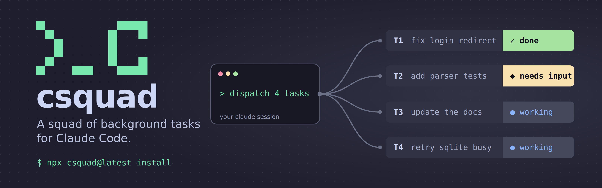

<p align="center">
  
</p>

<p align="center">
  <a href="https://www.npmjs.com/package/csquad"></a>
  <a href="LICENSE"></a>
  = 18">
</p>

**Hand work to a squad of background [Claude Code](https://claude.com/claude-code) sessions, and watch them from your status line.**

You keep talking to one normal `claude` session. Ask for a few tasks and each
becomes its own background session, `T1 · title`, `T2 · title`, ..., working in
its own git worktree while you carry on. Zero dependencies, no daemon, no database.

## Quick start

```sh
npx csquad@latest install
```

Then, in any `claude` session:

> Dispatch 3 tasks: fix the login redirect, add tests for the parser, update the docs.

That's it.

## How it works

```text
you     Dispatch 3 tasks: fix the login redirect, add tests for the parser, update the docs.
claude  launched T1 · fix login redirect, T2 · add parser tests, T3 · update the docs.
        They run in the background; check agent view or the status line.
```

Your status line now has a chip per task, most urgent first:

```text
T2  add parser tests       ◆ needs input    T1  fix login redirect     ✓ done
T3  update the docs        ● working
```

```text
you     How are my tasks going?
claude  T2 needs input: "Should the parser reject empty files or return []?" Answer it in
        agent view, or tell me and I'll pass it on. T1 is done: fixed the redirect loop on
        /login, tests pass, branch worktree-t1-fix-login-redirect. T3 is still working.
you     Tell T2 to return an empty list. Then merge T1.
claude  Sent to T2. T1 merged into main; its session, worktree and branch are removed.
```

Each task is a plain `claude --bg` session with a small set of worker rules
appended to its system prompt: work autonomously, use an isolated worktree and
branch, clean up after itself, commit, and end with a short result. Workers never
report back on their own, and nothing merges until you ask.

## The skills

Just ask; Claude picks the skill from what you say.

| Skill | What it does | Say something like |
| --- | --- | --- |
| `create-task` | Starts one background session per task, numbered `T1`, `T2`, ... | "Create a task to retry on SQLite busy errors." "Queue three tasks: ..." |
| `task-status` | Reports state and latest message of each task: needs input, failed, done, working | "How are my tasks going?" "Which tasks need input?" |
| `message-task` | Sends follow-up instructions to a task (Claude Code's native `SendMessage`) | "Tell T3 to also handle the empty-input case." |
| `watch-task` | Opt-in: runs a background command that checks the named tasks every 10 s and tells you when one needs input, finishes, fails or disappears. Never runs unless you ask | "Watch T3." "Tell me when T2 is done." "Stop watching." |
| `finish-task` | Merges a done task, then removes its session, worktree and branch, only after checking the work is merged | "Merge and clean up T2 and T4." "Finish everything that is done." |

## The status line

Your own status line stays exactly as it is; csquad prints it first, then a grid of
task chips below it:

| Badge | Meaning |
| --- | --- |
| `◆ needs input` | the task is waiting on an answer; reply in agent view |
| `✓ done` | finished; ask Claude to merge it |
| `✗ failed` | the session failed |
| `● working` | still running |
| `■ stopped` | stopped before finishing |

The chips show only the tasks launched by the **current session**. `/clear`
starts a new session, so earlier tasks drop off the line but keep running; the
full list is always in agent view (`claude agents`), or ask Claude to
"show all tasks".

`install` wraps your existing `statusLine` instead of replacing it: the original
command is saved to `csquad/statusline.json` and run at render time with the same
input. Other `settings.json` keys, ordering and indentation are untouched.
`uninstall` restores the original `statusLine` byte for byte (or removes the key
if you had none). A project-level `.claude/settings.json` that sets `statusLine`
overrides the wrapper in that project; `install` and `status` warn about it.

## Install, update, uninstall

```sh
npx csquad@latest install     # copy the skills and tasks.js, wrap the status line
npx csquad@latest update      # after a new release
npx csquad@latest uninstall   # restore the status line, remove everything csquad installed
npx csquad@latest status      # what is installed and whether the status line is wrapped
```

Files go to `$CLAUDE_CONFIG_DIR` (default `~/.claude`), so set the variable the
same way for every command:

```text
csquad/tasks.js  csquad/worker.md  csquad/manifest.json  csquad/statusline.json
skills/{create-task,task-status,message-task,watch-task,finish-task}/SKILL.md
```

Install and update are idempotent. If you edited an installed file, the next
run saves your version as `<file>.bak` and says so before overwriting it. Your
`config.json` is never touched, and running task sessions are not affected.

## Configuration

`<claude dir>/csquad/config.json`, optional:

```json
{ "permissionMode": "bypassPermissions", "model": "" }
```

- `permissionMode`: passed as `--permission-mode` to every task. The default,
  `bypassPermissions`, lets workers act without prompting; use `"acceptEdits"`,
  `"plan"` or `""` (Claude Code's default) for something stricter.
- `model`: passed as `--model`; empty uses Claude Code's default.

If a launch fails because the workspace is not trusted, open `claude` in that
directory once and accept the trust prompt.

## Requirements

- Node.js 18 or newer
- Claude Code with background sessions (`claude --bg`, `claude agents`)
- Linux, macOS, Windows or WSL. On Windows, Claude Code runs status line
  commands through Git Bash, so csquad does too for your original status line
  (without Git it falls back to `cmd.exe`). The skills work in Claude Code's Bash
  or PowerShell tool alike. A native `claude.exe` (the native installer) or the
  npm `claude.cmd` both work.

## Upgrading from the Go CLI (0.x)

1.0 replaces the Go binary with this npm package; Homebrew and APT are
discontinued. Remove the old install first:

```sh
brew uninstall csquad            # Homebrew
sudo apt remove csquad           # APT
npm uninstall -g csquad          # an old global npm install would shadow npx
rm -rf ~/.local/share/csquad ~/.config/csquad   # old data and config
```

Then run `npx csquad@latest install`. Old `T<n>` sessions keep working.

## Development

```sh
npm test    # node:test, against temporary CLAUDE_CONFIG_DIRs and a fake `claude`
```

See [CONTRIBUTING.md](CONTRIBUTING.md). MIT licensed.
