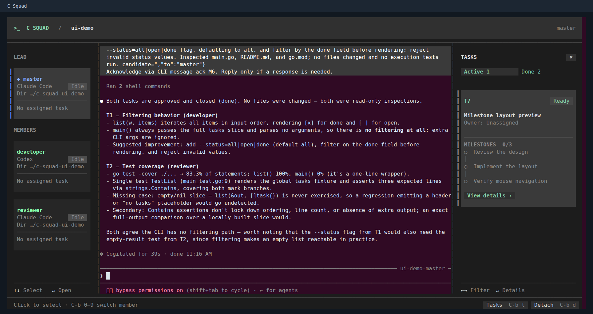

# Using C Squad

List saved teams with `csquad list`. Run `csquad new -s research` to create a new
team. An existing name is always an error, whether the team is running, stopped,
or interrupted; rejection does not clean up or resume that team. Bare `csquad`
also creates a new team, and `--name NAME` remains supported.
Use `csquad resume research` to continue a stopped or interrupted team,
`csquad attach research` to enter a running team, or
`csquad --team-name research member attach reviewer` to open one member.
`csquad stop research` stops processes while keeping recoverable work.
`csquad recover research` restarts only master in an active team from an outside
terminal; it does not replace whole-team `resume`.

The legacy `start NAME`, `start --name NAME`, and bare `csquad` remain
supported. See the [CLI design](cli-design.md) for the command mapping and
intentional differences from tmux.

Start a team in your project with `csquad start`, or `csquad start --profile pro`
to launch Master from a configured [launch profile](#launch-profiles). This opens
the Master session. Tell it what you want built and how you want work divided; it
recruits and coordinates members.

The task board is primarily for agents. Master uses it to track ownership,
progress, blockers, and review/test evidence. You can ask Master for a summary
or inspect the underlying state with `csquad board`.

| Action | Shortcut or command |
| --- | --- |
| Open a member with the mouse | Click its name in the left sidebar |
| Switch to the previous or next member | `Alt+Up` / `Alt+Down` |
| Return to Master | `Ctrl-b 0` |
| Open a numbered member | `Ctrl-b 1` … `Ctrl-b 9` |
| Detach and leave the team running | `Ctrl-b d` |
| Start without taking over your terminal | `csquad start --detach` |
| Inspect progress | `csquad board` |
| Restart a member | `csquad member restart alice` |
| Stop the team | `csquad stop` |
| Recover an interrupted team | `csquad resume` |

Outside a team session, use `csquad --team-name research COMMAND` or
`csquad --state-dir /path/to/team COMMAND`. The existing `--team DIR` still means
a state directory. Supply only one selector: positional team name, `--name`,
`--team-name`, `--state-dir`, or `--team`. `new` and `start` accept only a new positional
name or `-s` / `--name`; neither selects existing state. With no selector, existing-team
operations use the bound session, then the current project's last team, then the
legacy global last team. Names match exactly. Team state is normally in
`.csquad/teams/<name>/`. Member sessions cannot select another team or override
bound caller/generation identity. Completion uses the same selection rules.

Member instructions use `csquad COMMAND`, with the selected executable made
available on the member's PATH. `--member` identifies the caller, not an attach
target. Legacy `attach --name TEAM MEMBER` and bound-session `attach MEMBER`
remain supported; prefer `member attach MEMBER` for an unambiguous member target.
Team shortcuts do not modify `~/.tmux.conf`.

Mouse support is enabled only in team sessions. Click a member in the sidebar to
switch sessions, use the wheel to scroll, and drag pane borders to resize.
Native agents control mouse behavior inside their own interfaces.
In most terminals, hold Shift while dragging to select text without sending
mouse events to tmux.

Master process exit stops the team; detaching does not. Recovery preserves
worktrees and uncommitted changes. `resume --fresh` starts new native sessions
when old session history is unavailable. A machine shutdown cannot execute
cleanup immediately; the next start/resume checks for remaining state.

## Configure only what you need

The first configuration load creates `~/.config/csquad/config.toml` with detailed
comments and the two built-in launch profiles written out. Run `csquad config` to
inspect the effective values and configuration path. An optional project
`.csquad.toml` overrides user settings by field.

```sh
csquad start                # Master uses master_profile
csquad start --profile pro  # or a profile you name
```

The Master recruits members through `csquad member add`, supplying their name,
their responsibilities, and optionally a profile. You can describe the team you
want in plain language.

### Launch profiles

A profile is a reusable launch definition: engine, model, environment overrides,
and an optional command. It is the only place launch settings live. Define one per
way of starting an engine — for example one account and model for routine work and
another for harder work:

```toml
default_profile = "std"   # used by member add when --profile is omitted
master_profile = "pro"    # used by start when --profile is omitted

[profiles.std]
engine = "claude"
model = "sonnet"
  [profiles.std.env]
  CLAUDE_CONFIG_DIR = "/home/you/.claude-std"

[profiles.pro]
engine = "claude"
model = "opus"
  [profiles.pro.env]
  CLAUDE_CONFIG_DIR = "/home/you/.claude-pro"
  [profiles.pro.command]   # optional wrapper or renamed client
  executable = "claude-pro"
```

```sh
csquad start --profile pro
csquad member add dev --profile std --instructions "Own the refund endpoint..."
```

Profile names use letters, digits, `_` and `-`. Every profile names its
`engine`; one without it fails when the configuration loads. An unknown name
fails with the list of names you have defined. `csquad member profiles` lists them for a
running team, with each profile's engine, model, whether it uses a custom
command, and which pointer selects it. It shows the names of a profile's
environment variables but never their values, so Master can choose a profile
without seeing account paths or tokens.

Profiles follow the configuration file while a team runs. A profile you add or
edit is usable by the next `member add`, and reaches an existing member at its
next restart or resume. If the file stops loading, the team keeps the profiles
it last read and prints a warning. A new configuration is created with the built-in
defaults written out as `[profiles.codex]` and `[profiles.claude-opus]`; edit,
rename, or delete them, keeping the pointers in step. Without `default_profile`
and `master_profile`, members start `codex` and Master starts `claude` with
`opus[1m]`.

The command line carries exactly two things: which profile to launch with and
what the member is for. There are no per-setting flags: `--engine`, `--model`,
`--env` and `--role` were removed, and using one fails with the profile field to
set instead. A member therefore always launches exactly what its profile says.

A profile holds only *how* to launch. It never holds responsibilities: a member's
identity always comes from `member add --instructions`, written for that member.
Profile names carry no meaning of their own either — a profile named `master` is
applied to Master only if `master_profile` or `start --profile` says so, and a
member's name or instructions are never matched against a profile name.

Engine, model, and environment are materialised into the member's record when it
is added. Later configuration edits never change an existing member's engine or
model; its environment follows an edit only where `resume` updates variables it
inherited from the profile (see [Recovery environment](#recovery-environment-and-missing-directories)),
and all three follow with `--reprofile` below. The
command is resolved at launch through the recorded profile name, read from the
current configuration, so an edited wrapper reaches the next restart. Removing a profile that an existing member was
added with is not fatal: that member launches the engine by name with a warning,
and keeps the account it was added with. Changing that profile's `engine` is
treated the same way, because its command and environment were written for the
other engine.

To apply an edited profile to an existing member, for example after switching
`CODEX_HOME` or `CLAUDE_CONFIG_DIR` to another account, restart it explicitly:

```sh
csquad member restart dev --reprofile            # re-read its recorded profile
csquad member restart dev --profile claude-opus  # move it to another profile
csquad recover --reprofile                       # Master, from an outside terminal
```

The member keeps its name, instructions, tasks and directory. Its engine, model
and environment are re-read from the current configuration, and the command
prints what changed, naming environment variables without their values, before
the member stops. The account selectors `CODEX_HOME` and `CLAUDE_CONFIG_DIR`
keep the values recorded when the member was added, whatever the terminal
running the command has set; only a profile that sets one (an empty value unsets
it) changes it, including after a switch to the other engine. If the
configuration does not load, the command fails before stopping the member. The
conversation resumes unless the engine or its account directory changed, in
which case it starts fresh with the handoff. Without `--reprofile`, `restart`
keeps the member's engine, model and environment, and `resume` keeps engine and
model and updates only inherited variables; after updating them it prints one
line naming the members whose current profile still differs, without values.

An earlier `[templates]` table is migrated to profiles of the same name the first
time the configuration loads, and so are the former top-level `engine`, `model`,
`master_engine`, and `master_model` fields, the shared `[env]` and `[startup_env]`
tables, and `[engine_commands.ENGINE]`. Shared environment entries are merged into
every profile in the order the old launch path used — `[env]`, then the profile's
own values, then `[startup_env]` — and a legacy engine command into the profiles
launching that engine, or into a profile created for it when none does. A saved
team's existing members are pointed at the profile their launch settings became,
so a configured wrapper keeps launching them. The original file is copied to
`config.toml.before-profiles` before the migrated version is written. A template's
`prompt` is discarded, because responsibilities now come from `--instructions`;
the original text remains in the backup. A template that set no engine becomes a
profile with the engine its role used to default to: `master_engine` or `claude`
for `templates.master`, otherwise `engine` or `codex`. `member add --template`
has been removed.
Migration keeps the values you wrote: a `master_model = "opus"` still launches
`opus`, `master_model = ""` still launches the engine's native default model, and
only a configuration that did not write `master_model` uses the built-in `opus[1m]`. When
`templates.master` or `templates.developer` exists, the top-level fields for that
role replace only the template's engine or model; the migrated profile keeps the
template's environment.

### Custom engine executables

For renamed clients or wrapper scripts, give the profile a command table in the
user configuration or the project's `.csquad.toml`:

```toml
[profiles.wrapped-claude]
engine = "claude"
  [profiles.wrapped-claude.command]
  executable = "cfuse"
  args = ["--cc"]

[profiles.wrapped-codex]
engine = "codex"
  [profiles.wrapped-codex.command]
  executable = "codex-alt"
  args = ["--profile", "work"]
```

`executable` is a command name on the PATH used to start C-Squad, or an absolute
path (spaces are supported). An omitted or empty executable uses `claude` or
`codex`. Omitted arguments default to an empty array. Project overlays merge
fields; set `args = []` to clear inherited arguments and `executable = ""` to
restore the native name. Relative paths containing directories are rejected.
No shell parses these values: `~`, `$HOME`, substitutions, and quoting are not
expanded. Supply each argument as a separate array item, including values with
spaces; do not put a whole shell command in `executable`.

Every invocation is `executable` + configured `args` + C-Squad's generated
arguments. This includes `doctor` probes, Codex `app-server` configuration lookup
and `queue` messaging, and Claude `agents` observation, as well as interactive
launches. Master and each member use the command of the profile they were
launched with; a profile without a command table runs the engine by name. Generated
identity, hooks, model, permission and resume arguments remain unchanged. Avoid
conflicting options in the prefix; duplicate-option behavior belongs to the
underlying client.

The example invokes `cfuse --cc` followed by C-Squad's normal Claude arguments.
A wrapper must consume its own prefix options and forward all
remaining arguments to a compatible Claude Code client. Custom commands do not
make an arbitrary client compatible: the wrapper must support the selected
engine's CLI, hooks and communication protocol, including helper subcommands.
Use environment overrides below for account configuration; do not place secrets
in fixed arguments, which can appear in process listings and configuration output.

New teams snapshot the profile tables, and every member launch, including
`member restart` and `recover`, refreshes them from the current configuration
first. `resume` likewise reloads the profiles from the
current user/project configuration before starting any member; removing a
command table restores the native commands. Changing the command alone preserves
conversation IDs. Use `resume --fresh` when the replacement cannot read the old
client's sessions. `doctor --strict --engine codex` checks the configured command's
availability; it does not certify protocol compatibility or authenticate accounts.

For a persistent shell alias, explicitly select the shell instead:

```sh
# Define in ~/.zshrc (or ~/.bashrc when selecting bash).
alias mycc='ANTHROPIC_BASE_URL=https://example.invalid cfuse --cc'
```

```toml
[profiles.aliased]
engine = "claude"
  [profiles.aliased.command]
  shell = "zsh" # or "bash"
  executable = "mycc"
  args = []
```

This starts an interactive Zsh or Bash to load its normal rc file (including
Zsh's `ZDOTDIR`) and expands that specific alias, including leading environment
assignments. The alias name is not hardcoded. It must start with a letter or
underscore and otherwise contain letters, digits, `_`, `.`, `+`, or `-`.
Use a simple alias to an executable with optional environment assignments and fixed arguments; shell functions,
pipelines, chained commands, and arbitrary shell command templates are not
supported. A wrapper script can implement more complex preparation.
An alias defined only in an existing terminal cannot be inherited by a new
process; put it in the selected shell's rc file. C-Squad does not edit that file,
search other shells, or fall back to a native command if the alias is missing.
`args` and generated arguments use shell positional parameters, so their spaces,
quotes and metacharacters remain literal. Shell rc files and the alias definition
are user-controlled shell code; keep stdout quiet because native helper protocols
may parse it. Every probe/helper loads the same shell configuration. Existing
environment overrides (for example `HOME` or `ZDOTDIR`) also apply to those calls.
After rc loading, C-Squad restores its explicit configuration/member environment
and launch identity; environment values are not embedded in shell source or argv.
Without an explicit `PATH` override, directories added by the rc file remain
available. At engine launch, the generation's bound C-Squad launcher directory
is placed first. An explicit configuration/member `PATH` overrides the rc PATH,
also with that launcher first at engine launch.
Alias-local assignments then take precedence. Thus a global account variable in
`.zshrc` cannot replace a profile's `env` value, but an account-specific alias
can intentionally override it. Job control is disabled in this shell; C-Squad
tracks and stops the shell and client process tree together. The shell returns
the client's exit status (including the shell's usual status for a signal).
Unlike the saved alias name and argument configuration, rc file contents are not
snapshotted: editing the alias affects the next invocation, including helpers.

### Environment overrides

A profile's `env` table selects the account, or any other variable, for the
members launched with it:

```toml
[profiles.second-account.env]
CODEX_HOME = "/absolute/path/to/codex-config"
```

Precedence has two layers: the inherited environment, then the profile's `env`.
Running teams retain their startup configuration. On recovery, an edit to the
profile a member was added with applies to the values that member still holds
from it; anything the member picked up elsewhere remains intact, and a member
whose profile was deleted keeps its account. Changing `CODEX_HOME` starts a fresh
Codex conversation in that configuration directory while preserving the task
ledger and recovery handoff. Member
limits are configurable; there is no conversation-turn cap. A member's
`generation` identifies its current process incarnation, not an iteration limit.

`previous_member_key` and `next_member_key` control the member switch shortcuts;
they default to `M-Up` and `M-Down` (Alt/Option with the arrow keys). See
[member switch keys](#member-switch-keys-and-your-agent) for what binding them
takes away from your agent and how to release them.

**Agents bypass native approval prompts by default.** Set
`bypass_permissions = false` to retain approvals. With bypass enabled, C Squad
also confirms Claude's startup trust dialog for the member's selected working
directory. Claude saves its normal project trust record; C Squad does not set a
sandbox environment variable. This does not log in, supply
account quota, or override organization policy. Project files such as untracked
MCP configuration are not automatically copied into worktrees.

## Help and completion

```sh
csquad --help
csquad task create --help
csquad member add --help
```

Homebrew and APT install Bash, Zsh, and Fish completions automatically. In a new
terminal, type `csquad sta` and press **Tab** to complete `csquad start`. No
`csquad completion` setup command is needed. Your shell must have its normal
completion system enabled (for example, Oh My Zsh already enables Zsh completion).

Completion includes commands, flags, and IDs from the current team. It reads the
ledger without waking agents. `csquad question request` is a team escalation command
(the old `help request` alias remains available);
use `--help` or `csquad usage` for command documentation.

### npm, npx, and manual installs

npm includes completion scripts, but its executable link does not register them
with the parent shell. The npm launcher prints a setup hint once on an interactive,
unbound invocation; automation and completion requests remain silent. It runs no
install hook and never edits your startup files.

For macOS + Zsh, run `csquad completion install --shell zsh`, then run the printed
loading line in the current terminal. Add that same line at the end of `~/.zshrc`
(after Oh My Zsh or another completion framework) to make it persistent.

**Persistently.** `csquad completion install` writes the script for one shell
into a directory you own, defaulting to your login shell and to
`$XDG_DATA_HOME` / `$XDG_CONFIG_HOME` (`--shell` and `--dir` override both). It
rewrites the file only when the content changed, so repeating it is harmless,
and it prints the remaining step instead of performing it:

```sh
csquad completion install
csquad completion status            # installed files, and the check for each shell
```

| Shell | Default target | Remaining step |
| --- | --- | --- |
| Bash | `~/.local/share/bash-completion/completions/csquad` | none, but bash-completion v2 must be installed: it reads that directory and provides helpers the script calls |
| Zsh | `~/.local/share/zsh/site-functions/_csquad` | run the printed loading line now and add it at the end of `~/.zshrc` |
| Fish | `~/.config/fish/completions/csquad.fish` | none |
| PowerShell | `~/.local/share/csquad/csquad.ps1` | source it from `$PROFILE` |

Paste the line the command prints rather than retyping it: paths are quoted for
spaces and special characters. For Zsh it initializes `compinit` if necessary and
sources the script directly. This also registers completion when an older cached
index has no csquad entry; no `fpath` edit or `.zcompdump` deletion is needed.

Installing a file cannot modify an already-open parent shell. Run the loading
line there for immediate use, or start another shell after saving it in `.zshrc`.

**Verify** in that new terminal with `csquad sta` + **Tab**, or query the shell
directly — `print -r -- ${_comps[csquad]:-missing}` in Zsh (prints `_csquad`),
`complete -p csquad` in Bash, `complete -c csquad` in Fish. `csquad completion
status` reports the files on disk; it cannot see a running shell's state,
because no shell exports its `fpath` or its loaded completion functions.

**nvm and upgrades.** The installed script locates `csquad` on `PATH` when you
press Tab and lives in your data directory rather than under the Node prefix,
so switching Node versions with `nvm use`, upgrading Node, or running
`npm install -g csquad@latest` leaves it working. Re-run
`csquad completion install` only to pick up completions for newly added
commands; `csquad completion status` reports `differs` when the file no longer
matches the installed binary. Each Node prefix still needs its own executable on
PATH. Uninstalling the npm package retains user-owned completion files and the
hint marker at `${XDG_STATE_HOME:-~/.local/state}/csquad/npm-completion-notice-v1`;
remove your loading line yourself if you stop using C Squad.

## Compatibility and limitations

- **Early-stage software.** Linux has been exercised with real Claude Code/Codex
  sessions. macOS and Linux ARM64 builds exist; macOS/WSL runtime acceptance is
  still pending. Native Windows is not supported.
- **Native engine compatibility matters.** Prior manual checks used tmux 3.4,
  Claude Code 2.1.276, and Codex 0.154.0. Engine updates may require adapter changes.
- **Messages can be retried.** Delivery is not exactly-once; a transport acceptance
  is not proof of reading or completion. Routine ACKs are optional; successful
  sends are not retried automatically on restart/resume, while failed or interrupted
  transport can retry. Persistent failures appear on the board.
- **Local state stays local.** `.csquad/` holds recovery data and should not be
  committed. Use local disk for the SQLite ledger. A per-team runtime handles
  delivery and cleanup; no system service is installed.
- **Upgrades are explicit.** Stop running teams before replacing the CLI binary.

## How tasks are coordinated

Members share a persistent task board and can send direct messages or broadcasts.
Claude receives messages in its native peer envelope; Codex receives a compact
sender header. Both use the same task records, acknowledgments, and reply routing.
Coordination instructions are injected into session context, not appended to every
message. Claude may still display its own native peer notice.
They report meaningful milestones and ask Master for help when blocked. Master
brings questions that need a human decision back to you.

A code task gets a Git worktree, even when it has only one developer. Its owner
writes the code; other members review or test it. Separate implementation tasks
use separate worktrees. Code tasks require a Git repository with an existing
commit; research tasks can run without Git.

A code task worktree is always created in the team repository. It does not follow
a member's `--cwd`, so a member working in a different repository cannot submit
its commits: `csquad` warns about this when the task is created or assigned. When
work has genuinely landed in another repository, Master can close the task on that
commit:

```sh
csquad task close-external T7 --repo /path/to/other-repo --sha 9f3c1ab \
  --reason 'Work was pushed from the member repository'
```

That records the commit, the reason and what was not verified, and frees the
owner. It is not a merge: nothing is fetched into the team repository, and the
task is shown as closed externally rather than merged.

Review and test evidence refer to a specific candidate commit. Master approves
and performs the merge through C Squad. If you want a human checkpoint, tell
Master to ask you before merging.

C Squad injects coordination instructions into native engine sessions. No extra
collaboration skill or MCP server is required. Native MCP configuration and
account authentication remain under each engine's control. The application uses
a local SQLite ledger and a per-team runtime; it installs no system service.

## Member colors

Give collaborators the same status-bar color to make a task group easy to spot:

```sh
csquad member add developer --instructions "Implement the refund endpoint" --color mint
csquad member add reviewer --profile pro --instructions "Review the refund work" --color mint
```

Colors are visual labels, not task assignments or status indicators. Master is
prompted to use matching colors for collaborators, but this is optional. Without
`--color`, a random color is selected and retained across restarts and recovery;
duplicates are allowed. Use `csquad start --color blue` to color Master as well.

Available colors: `red`, `orange`, `amber`, `yellow`, `lime`, `green`, `mint`,
`teal`, `cyan`, `sky`, `blue`, `indigo`, `violet`, `purple`, `pink`, and `rose`.
The current member has a filled label; other members use colored text. Terminal
color themes can affect their appearance. `--color` supports shell completion.

## Team panels



On wide terminals, new teams open both the member sidebar and task board beside
the native agent terminal. `Alt+Up` and `Alt+Down` switch to the previous or
next member in one keypress, from anywhere in the session; the list is cyclic,
so `Alt+Down` on the last member returns to Master. You can also click a member,
or focus the sidebar first and then select with the arrow keys and press Enter:
the sidebar is a separate tmux pane, so plain arrow keys reach it only while it
holds focus, which is why the Alt shortcuts exist. Each member
block shows its engine, working directory, status, and assigned task IDs. Long
paths retain their trailing directory components; task details show the full workspace. The agent's
terminal remains a native tmux pane; click it to resume typing.

| Action | Shortcut or command |
| --- | --- |
| Switch to the previous or next member | `Alt+Up` / `Alt+Down` |
| Toggle the member sidebar | `Ctrl-b b` |
| Toggle the task panel | `Ctrl-b t` |
| Show members and tasks | `csquad ui` |
| Show only tasks beside the terminal | `csquad ui --view tasks` |
| Hide both panels | `csquad ui --view hide` |
| Collapse the task panel | Top-right **×**, `q` or `Esc` |
| Return to Master | Click the pinned Master card |

### Member switch keys and your agent

The team binds `Alt+Up` and `Alt+Down` in its own tmux key table, which consumes
them before the pane sees them. **The agent CLI in the engine pane no longer
receives those keys.** For Claude Code that costs its `meta+up` / `meta+down`
bindings, which move through the diff file list and jump the message selector to
top or bottom; both actions keep their other default bindings (`ctrl+up` /
`ctrl+down`, and `shift+up` / `shift+down` for the message selector), so nothing
becomes unreachable. Codex does not bind these keys. tmux treats Alt and Meta as
one `M-` namespace, so it cannot bind one encoding and pass the other through.

Remap or release them in your configuration:

```toml
previous_member_key = "C-M-p"   # any tmux key name, for example M-Up, C-M-n, F5
next_member_key = "C-M-n"
```

Set either to an empty string to leave that key to your agent and navigate with
`Ctrl-b 0`–`9` or the sidebar instead. A key name tmux does not recognise is
rejected when the configuration loads rather than producing a binding that never
fires.

On macOS, Terminal.app sends Option as an accent composer unless **Use Option as
Meta key** is enabled in its keyboard settings; without it the Alt shortcuts
never reach tmux. iTerm2 and most Linux terminals send Alt correctly.

Each member card names the Git branch of that member's OWN working directory -
`Git main`, `Git detached 4f2a1b9`, or a branch with `wt` when the directory is a
linked worktree. It is the member's directory, not the repository its task is
bound to, which is what matters when a member works in another repository. Long
branch names keep their trailing segment; `csquad member inspect NAME` prints the
untruncated value under `git`. Nothing Git-related is written to the ledger, and
the panel only reads repository state.

When the roster is longer than the sidebar, a position indicator appears in the
right-hand gutter showing how far through the list you are. It is absent when
every member already fits.

The workspace header displays the C Squad mark and team name.
The bottom footer has clickable **Tasks** and **Detach** buttons.
Tasks toggles the right panel; the member sidebar stays open. Detach disconnects only your terminal; the
team keeps running. Button labels include their keyboard shortcuts.

Master stays pinned above the scrolling member list, marked with a diamond.
Member names always use their assigned colors, including unselected members.

The task panel opens on **Active**, which includes pending, working, and review tasks.
Completed tasks move to **Done**. Click either filter or use the left/right arrow
keys to switch; both filters show their task counts.

The task panel shows the recorded task phase, owner, collaborators, acceptance
criteria, latest progress report, blockers, checkpoints, and review/test evidence.
Tasks appear as vertically stacked cards with their status, owner, and latest
progress. Cards show structured milestones, including checkpoints awaiting approval.
Click **View details** or press Enter to read the full task in the panel. Escape
or **Back to tasks** returns to the list; the wheel and Page Up/Down scroll details.
Press `o` to open the task owner's terminal. The right panel is dedicated to
tasks. Questions are handled through Master; this panel does not assign tasks,
approve merges, or infer completion from terminal output.

At 150 columns or wider, both panels fit beside the terminal. Between 90 and 149
columns, the member sidebar stays visible and Tasks opens in a popup. Below 90 columns,
side panels are hidden; the panel shortcuts open a temporary popup instead.
Expand the terminal to restore the chosen layout. Pane borders can be dragged to
adjust widths; resizing the terminal restores the standard sidebar widths. The header stays three rows high. As with normal tmux panes, clients attached to the same session
share its layout and panel selection.

### Member working directories

For a team spanning several projects, set each member's actual startup directory:

```sh
csquad member add api-reader --cwd /path/to/api --instructions "Research the upstream API"
csquad member restart api-reader --cwd /path/to/api
```

The directory must exist. Relative paths resolve from the calling directory.
Without `--cwd`, creation uses the `--task` workspace when available, otherwise the
team root; restart and replace retain the existing member directory.
Restart resumes the conversation. Replace starts a new conversation.

The mouse wheel scrolls panel content without changing selection. Click a member
to switch terminals; arrow keys move the selection and Enter opens it. Master
remains pinned while the member list scrolls.

## Text inputs, query output, and compatibility

Use `question request|list|answer` for escalation and `message reply MESSAGE` for
replies. Existing `help request|list|answer` and top-level `reply` retain their
behavior, including question blockers and reply deduplication. `sync` starts an
active team's runtime when needed and retries delivery; `reconcile` separately
reconciles durable merge intents.

Commands accepting `--text`, `--summary`, `--instructions`, or `--description`
also accept the corresponding `--FIELD-file FILE`. A filename of `-` reads stdin.
Inline and file forms are mutually exclusive; only one field may consume stdin.
File content is preserved exactly, including newlines; empty files are rejected.
Required text/summary fields accept either form. For example:

```sh
csquad message send reviewer --text-file ./review-request.txt
csquad task submit T7 --summary-file ./result.md
csquad question request --task T7 --text-file - < ./question.txt
csquad member add reviewer --instructions-file ./responsibilities.md
csquad task create 'Fix login' --acceptance 'Regression passes' --description-file ./issue.md
```

`list`, `board`, `member list|inspect`, `task list|inspect`, `message inbox`, and
`question list` accept `--output json|table`. Omitting the flag preserves existing
output: saved-team `list` uses a table; other queries use JSON. JSON result shapes
are unchanged. List tables show one resource per row with its identity, state, and relevant
owner, sender/recipient, or text columns. Board tables show team status plus
members, tasks, and questions. These are concise projections; use JSON for full
history and metadata. Inspect tables retain detailed fields with nested JSON.
Embedded control characters are escaped to preserve table rows. Output format flags do not apply to interactive startup, attach,
or completion script generation. Usage failures exit 2; operational failures exit 1.

Hidden runtime commands remain callable at their original paths. The additive
`_internal COMMAND` aliases normalize to the same operation before identity and
permission checks; the namespace itself grants no extra authority. Native
`run-engine -- ...` arguments remain opaque, including through its internal alias.

Saved-team removal is separate from stopping. From an outside terminal, inspect
`csquad team remove NAME --dry-run` before `csquad team remove NAME`. Removal
requires stopped state, no remaining processes or sessions, no pending merge,
and clean, fully merged owned worktrees. It removes eligible task worktrees and
the saved ledger, preserves Git branches, and refuses unknown or external
worktree paths, unknown payload, or nested repositories. Ignored files are listed
by dry-run and prevent removal unless `--discard-ignored` is supplied explicitly.
There is no force flag to discard uncommitted or unmerged work. A leftover tmux
socket from a crashed server is accepted only when its endpoint is absent or
refuses connections. Reachable sockets still require successful tmux session
inspection; permission, timeout, and protocol errors prevent removal. Inspection
does not delete the stale socket.

Every submission has an immutable identity. For formal research/non-code review,
use `task evidence TASK --submission ID --kind review --passed true --summary TEXT`.
Code evidence retains exact `--sha COMMIT` compatibility. See
[task submissions and evidence](task-evidence.md) for revision fencing, retries,
and approval policy.

## Member command shells and PATH

C Squad puts a generation-specific `csquad` link on each member's PATH, pointing
to the executable selected for the team. Run team commands in a **non-login
shell** to keep that PATH precedence. In Codex, set the `exec_command` tool's
`login` argument to `false`, for example:

```json
{"cmd": "csquad board", "login": false}
```

Use the same setting for every team operation, including after restart or resume.
Do not wrap the command in a login shell. In native Codex testing, default login
execution retained the private directory but put a global installation ahead of
it; `login: false` selected the private link. The exact shell setup or snapshot
responsible for that difference was not established. Default login execution
therefore does not guarantee the team's selected executable. The non-login
invocation requires no absolute CLI path, manual PATH override, or global shell
configuration change.
The bound team, member, and generation variables still identify the caller.

To check resolution in the same non-login tool shell, run `command -v csquad`
and `csquad version`. The first command should select the current member's
`runtime/<member>/<generation>/bin/csquad` link.

### Recovery environment and missing directories

`resume` reloads the profile tables from the current configuration. Each member
is then moved onto the current `env` of the profile it was added with: a value it
still holds from that profile follows the edit, a variable the profile no longer
sets is dropped, and anything else the member carries is left alone. A member
whose profile was deleted, or one added before profiles existed, keeps the
environment it was launched with. Account changes start a fresh native
conversation while preserving the team ledger and handoff. No environment values
are printed by recovery diagnostics.

"Still holds from that profile" is judged against the profile tables the team
last read. Any member launch reads them again, so an edit made before a
`member restart` or `member add` is not applied by a later `resume`; resume then
names that member in its profile notice, and `member restart NAME --reprofile`
applies it. Engine and model never change on resume.

Recovery checks all member directories before stopping old processes or starting
any new ones. If a worktree was removed, restore it, or update the saved directory
from an outside terminal while the team is stopped:

```sh
csquad --team-name research member set-cwd reviewer --cwd /existing/project
csquad resume research
```

`set-cwd` validates and records the directory without starting a member or changing
its task workspace. For a running team use `member restart NAME --cwd DIR`.
Launch errors identify the member, engine/executable, and working directory.

Member command launchers bind team, member, and generation even when an engine
filters `CSQUAD_*` variables from tool subprocesses. Conflicting identity flags
and launchers belonging to a stale generation still fail. Existing teams receive
the new launcher when members restart or the team resumes with the updated binary.
